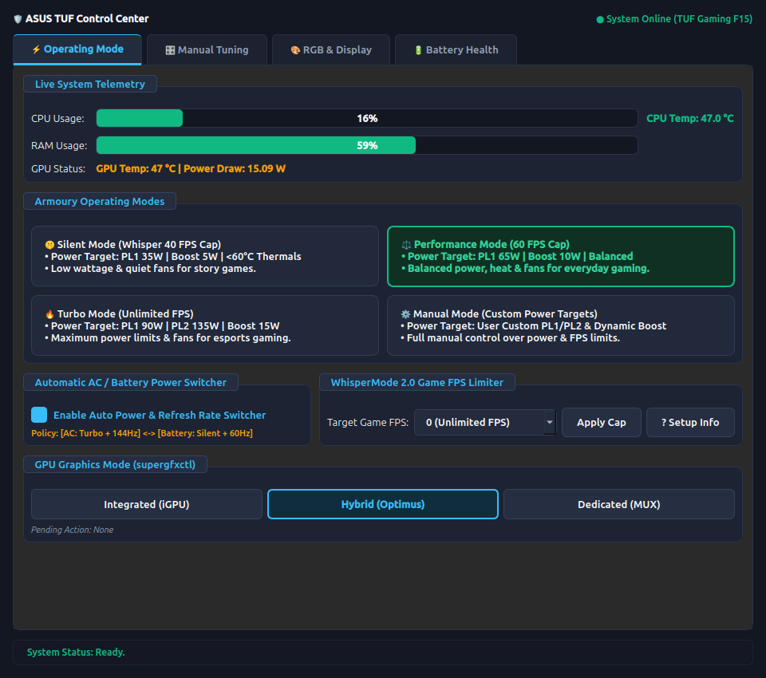
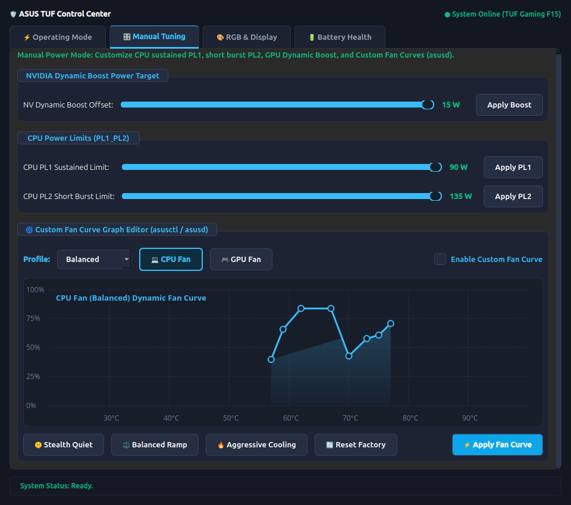
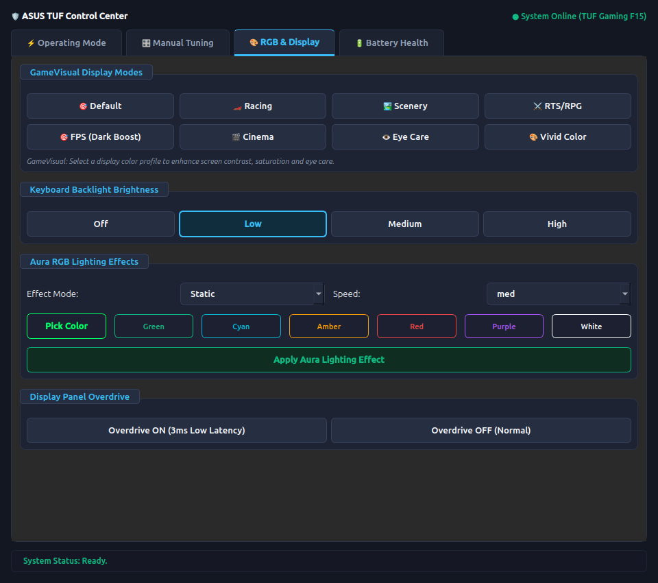
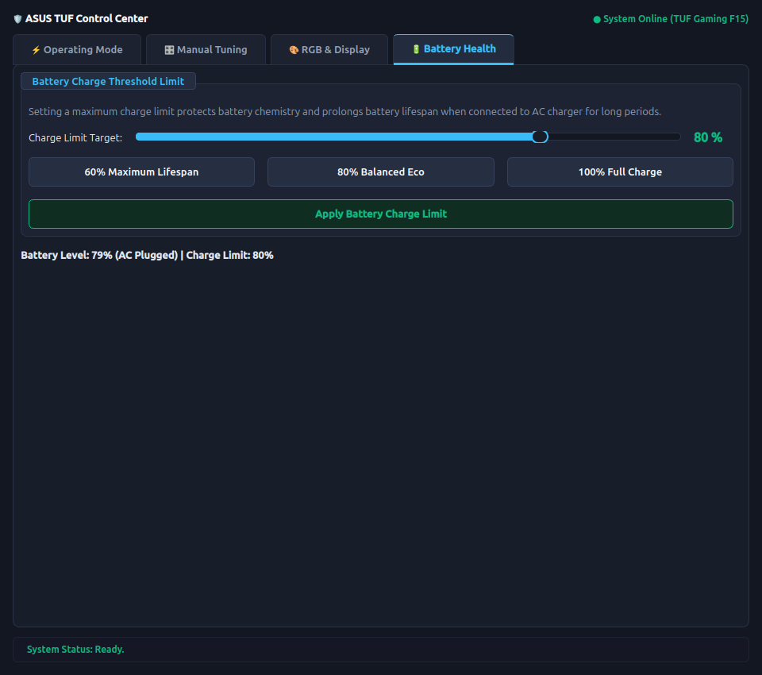

# 🛡️ ASUS TUF Control Center (Linux)

> A modern, fast, high-contrast Armoury Crate GUI for ASUS TUF & ROG Gaming Laptops on Linux (Ubuntu/Debian/Arch/Fedora).



---

## ❓ The Problem & Why This Exists

If you own an ASUS TUF or ROG laptop on Linux, you know that `asusctl` and `supergfxctl` provide amazing terminal controls, but typing terminal commands every time you want to switch fan profiles, check GPU temperatures, adjust GameVisual display color profiles, or edit fan curves is tedious. 

Furthermore, `rog-control-center` frequently panics on modern Ubuntu releases (due to Tokio async runtime conflicts).

**ASUS TUF Control Center** was created to solve this exact problem: giving you a clean, sleek 1-click GUI that matches **Armoury Crate** operating modes, WhisperMode 2.0 quiet gaming, GameVisual display modes, interactive Fan Curve tuning, and physical hardware key integration—open-sourced for the Linux ASUS community!

---

## 📸 Screenshots & Showcase

| 🎮 Armoury Crate Operating Modes & Telemetry | 🌀 Custom Fan Curve Graph Editor & Power Limits |
| :---: | :---: |
|  |  |

| 🎨 GameVisual Color Profiles & Aura RGB | 🔋 Battery Health & Eco Charge Limit |
| :---: | :---: |
|  |  |

---

## ⚡ Key Features

- **🎮 Armoury Crate Operating Modes**:
  - 🤫 **Silent Mode (WhisperMode 2.0)**: Lowers CPU PL1 (35W) & GPU Dynamic Boost (5W), automatically caps game FPS to **40 FPS** via MangoHud & DXVK to keep CPU & GPU **under 60°C** with near-silent fans.
  - ⚖️ **Performance Mode**: Balances power, heat, and fan sound with standard wattage and a 60 FPS cap.
  - 🔥 **Turbo Mode**: Pushes hardware to maximum power limits (CPU PL1 90W, PL2 135W, Dynamic Boost 15W) with unlimited FPS.
  - ⚙️ **Manual Mode**: Unlocks custom sliders to fine-tune CPU PL1/PL2 & GPU Dynamic Boost power limits.

- **🔌 Automatic AC / Battery Power & Refresh Rate Switcher**:
  - **On AC Charger**: Auto-applies **Turbo Mode** + **144Hz Refresh Rate** + Unlimited FPS.
  - **On Battery Power**: Auto-applies **Silent Mode (Whisper 40 FPS)** + **60Hz Refresh Rate** for maximum battery life.

- **🌀 Custom Fan Curve Graph Editor**:
  - 8-point interactive temperature vs PWM % curve vector graph canvas (`FanCurveGraphWidget`).
  - Presets: *Stealth Quiet*, *Balanced Ramp*, *Aggressive Max Cooling*, *Reset Defaults*.
  - Dual CPU & GPU fan control with `asusd` `/etc/asusd/fan_curves.ron` integration.

- **🎨 GameVisual Display Color Profiles**:
  - 1-click Armoury Crate visual modes: **Default**, **Racing**, **Scenery**, **RTS/RPG**, **FPS (Dark Boost)**, **Cinema**, **Eye Care (Blue Light Filter)**, **Vivid Color**.
  - Dynamic `xrandr` gamma & brightness tuning for ASUS laptop screens.

- **⚡ GPU Graphics Mode Switcher**:
  - Switch between **Integrated (iGPU)**, **Hybrid (Optimus)**, and **Dedicated (MUX)** graphics via `supergfxctl` with active mode button selection highlighting.

- **🌈 RGB Aura Lighting & Screen Overdrive**:
  - Keyboard backlight brightness levels (Off, Low, Medium, High).
  - Aura RGB lighting modes (Static, Breathe, Rainbow Cycle, Wave, Pulse) & custom RGB color picker.
  - Display Panel Overdrive toggle (3ms Low Latency Mode).

- **🔋 Battery Health Care**:
  - Battery charge threshold limit slider (20% to 100%) and quick eco presets (60%, 80%, 100%).

- **⌨️ Physical Armoury Crate Hardware Key Support**:
  - Bound to the dedicated physical Armoury Crate top-row key on ASUS keyboards for instant access.

---

## 🚀 Quick Install & Setup

```bash
git clone https://github.com/YOUR_USERNAME/asus-tuf-control-center.git
cd asus-tuf-control-center
chmod +x install.sh
./install.sh
```

### Launch Options
- **Physical Key**: Press the dedicated **Armoury Crate key** on your keyboard.
- **Application Menu**: Search **ASUS TUF Control Center** in your app launcher.
- **Terminal**: Run `asus-tuf-gui`

---

## 🤝 Contributing
Contributions, issues, and feature requests are welcome! Feel free to check out the issues page if you want to contribute.

## 📜 License
MIT License. Free and open source for the ASUS ROG / TUF Linux Community.
